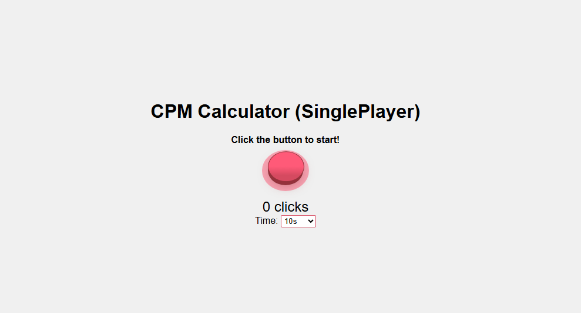

# 🖱️ Click Per Minute Game

A simple and fun browser-based game where you must click as fast as possible within a limited time.  
Challenge your reflexes, beat your own record, and test how many clicks per minute you can achieve!

---

## 🎮 Features

- ⏱️ Customizable time duration (X seconds).  
- 👆 Real-time click counter.  
- 📊 Displays your final score (clicks per minute).  
- 💡 Minimalist and responsive design.  
- ⚙️ Built with pure **HTML**, **CSS**, and **JavaScript** — no external libraries.

---

## 🚀 Demo

You can try the game live here:  
👉 http://cantinhodochico.ddns.net:6969/projetos/clickperminute/

---

## 🧠 How It Works

1. Press **Start** to begin the challenge.  
2. Click the button as fast as possible before the timer runs out.  
3. When time is up, your total clicks and average clicks per minute are displayed.  
4. Replay and try to beat your previous score!

---

## 🛠️ Technologies Used

| Technology | Purpose |
|-------------|----------|
| **HTML5**   | Game structure and layout |
| **CSS3**    | Styling and animations |
| **JavaScript (ES6)** | Game logic, timer, and score calculation |

---

## 📂 Project Structure

```
click-per-minute-game/
│
├── index.html         # Main game interface
├── style.css          # Game styles
├── script.js          # Game logic
└── assets/            # (Optional) images, icons, or sounds
```

---

## 🧩 Possible Improvements

- Add a leaderboard system using local storage or a backend.  
- Include sound effects for clicks and countdown.  
- Make difficulty levels with shorter or longer timers.  
- Support mobile touch interactions with vibration feedback.

---

## 📸 Preview



*(Replace with your screenshot if you add one to the repo)*

---

## 📜 License

This project is released under the **MIT License** — feel free to modify and share it.

---

# 🇵🇹 Click Per Minute Game (Versão em Português)

Um jogo simples e divertido baseado no navegador, onde o objetivo é clicar o mais rápido possível dentro de um tempo limitado.  
Desafia os teus reflexos, tenta bater o teu recorde e descobre quantos cliques por minuto consegues alcançar!

---

## 🎮 Funcionalidades

- ⏱️ Duração personalizável (X segundos).  
- 👆 Contador de cliques em tempo real.  
- 📊 Mostra o resultado final (cliques por minuto).  
- 💡 Design minimalista e responsivo.  
- ⚙️ Construído apenas com **HTML**, **CSS** e **JavaScript** — sem bibliotecas externas.

---

## 🚀 Demonstração

Podes jogar a versão online aqui:  
👉 [**Jogar Demo**](#) *(substitui pelo link real da demo)*

---

## 🧠 Como Funciona

1. Carrega em **Iniciar** para começar o desafio.  
2. Clica o mais rápido possível antes que o tempo acabe.  
3. Quando o tempo terminar, o total de cliques e a média por minuto serão exibidos.  
4. Joga novamente e tenta superar o teu resultado!

---

## 🛠️ Tecnologias Utilizadas

| Tecnologia | Finalidade |
|-------------|-------------|
| **HTML5**   | Estrutura e layout do jogo |
| **CSS3**    | Estilos e animações |
| **JavaScript (ES6)** | Lógica do jogo, temporizador e cálculo da pontuação |

---

## 📂 Estrutura do Projeto

```
click-per-minute-game/
│
├── index.html         # Interface principal do jogo
├── style.css          # Estilos do jogo
├── script.js          # Lógica e funcionamento
└── assets/            # (Opcional) imagens, ícones ou sons
```

---

## 🧩 Melhorias Futuras

- Adicionar um sistema de ranking com local storage ou backend.  
- Incluir sons de clique e contagem regressiva.  
- Criar níveis de dificuldade com tempos diferentes.  
- Suporte total a dispositivos móveis com vibração.

---

## 📸 Pré-visualização


*(Substitui pela tua imagem se adicionares uma ao repositório)*

---

## 📜 Licença

Este projeto está sob a **Licença MIT** — podes modificá-lo e partilhá-lo livremente.
